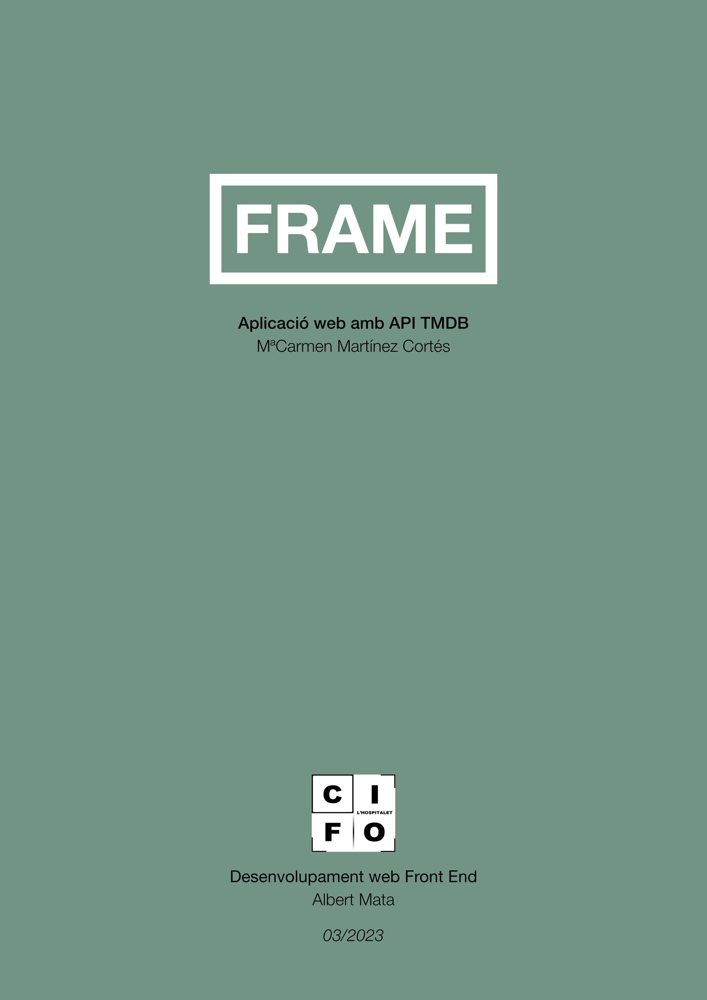
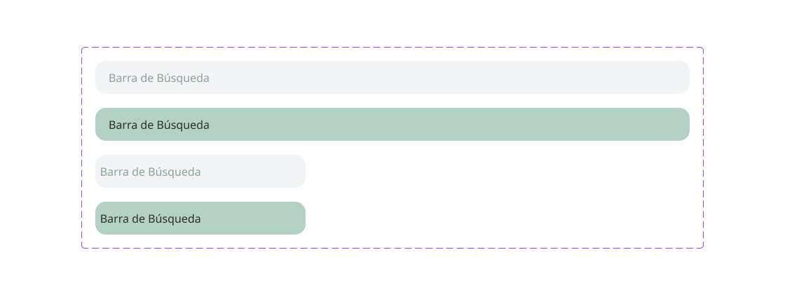
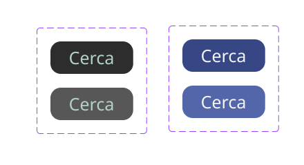
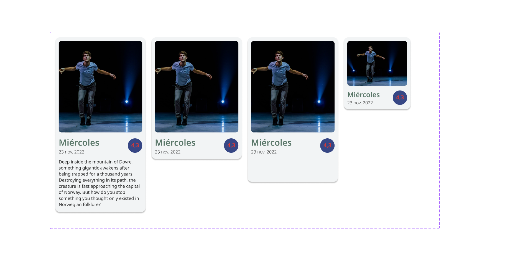
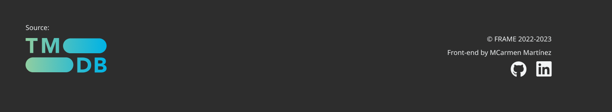
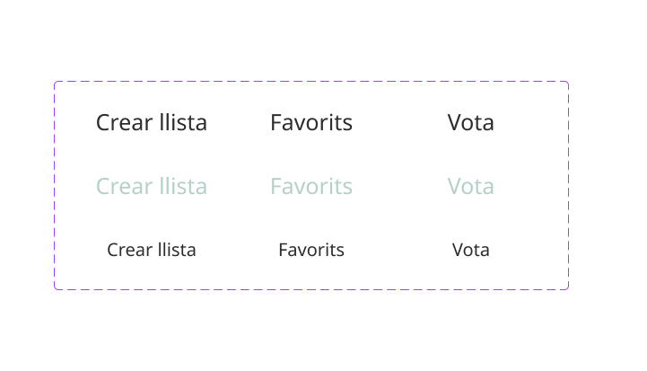
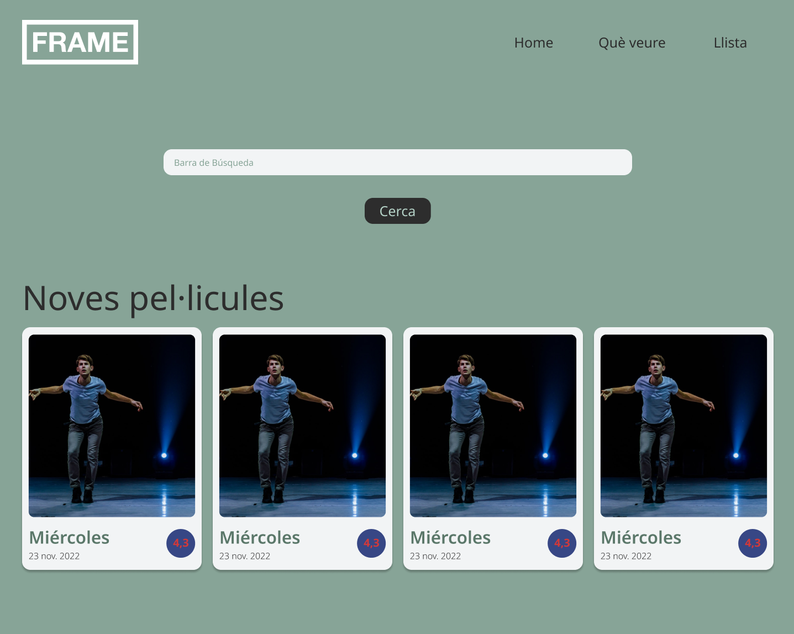
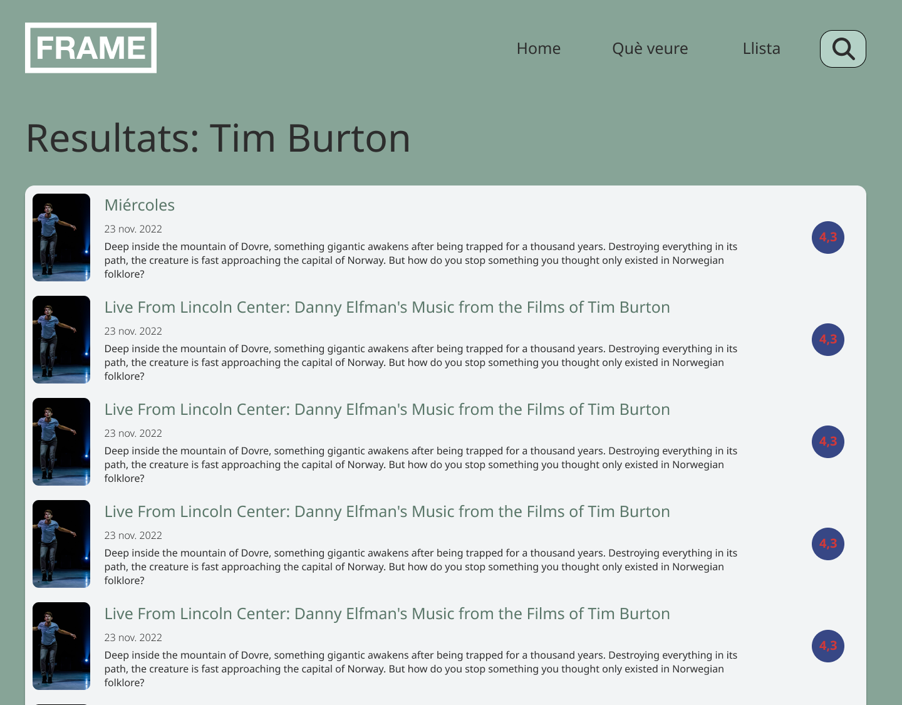
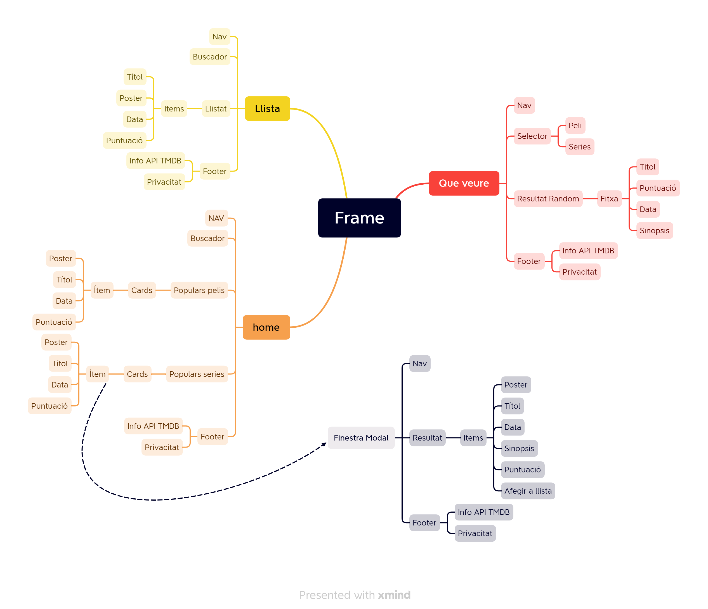



# Frame: Aplicació web amb API TMDB

## Introducció

En aquest projecte s'ha desenvolupat una aplicació web que utilitza l'API de TMDB per mostrar informació sobre pel·lícules i sèries. L'aplicació té diverses funcionalitats, com ara la visualització de les pel·lícules i sèries més populars en forma de targetes, la cerca de contingut específic, i una funció "Què veure?" que permet als usuaris obtenir una recomanació aleatòria de pel·lícula o sèrie.

## Tecnologies utilitzades

Per desenvolupar l'aplicació web s'han utilitzat les següents tecnologies:

- **HTML i CSS** per a la estructura i estil de la pàgina web.
- **JavaScript** per a la interacció dels usuaris i les crides a l'API de TMDB.
- **L'API de TMDB** per obtenir informació sobre pel·lícules i sèries.
  [API TMDB](https://www.themoviedb.org/documentation/api)
- **Figma** per fer la composició del disseny de la web.
  [Figma](https://www.figma.com/)

## Disseny

El disseny de l'aplicació s'ha desenvolupat amb l'eina Figma, on s'han realitzat diversos prototips dels models de les pàgines possibles i es van provar diferents paletes de colors i tipografies pels elements de la pàgina, com ara la barra de cerca, les targetes, els botons i el menú de navegació.

**Barra de cerca**



**Botons**



**Targetes**



**Menú navegació:**


**Footer:**



**Menú Navegació**



**Pàgina principal:**



**Pàgina cerca:**



En reproduir el disseny realitzat a **Figma**, la maquetació ha sigut principalment per versió d'escriptori.

## Esquema de la web

Per tal de poder desenvolupar l'estructura i el contingut de la pàgina, s'ha creat un arbre de continguts amb l'eina Xmind, que mostra l'organització de les diferents seccions i subseccions de la pàgina.

**Arbre de la Web**


## Funcionalitats

A continuació, es detallen les diferents funcionalitats que ofereix l'aplicació:

### Frame

La pàgina Frame consta d'una principal `index.html` on mostra les pel·lícules i sèries més populars del moment en forma de targetes, amb informació bàsica com el títol, la imatge de la portada, data i la puntuació. En fer clic en una targeta es mostra a l'usuari una finestra modal, on es pot veure informació més detallada sobre la pel·lícula o sèrie seleccionada, com ara el títol, la imatge de la portada, la sinopsi i altres detalls rellevants. Al menú navegació podem navegar per les diferents parts de l'aplicació web `list.html`i `see.html`.

A l'apartat de llista mostra el llistat de pel·lícules o sèries afegides per l'usuari, des de la finestra modal que apareix quan es fa clic a la targeta de la pàgina `index.html`. També pot realitzar una cerca de pel·lícula o sèrie, que es mostrarà en forma de llistat.

I per últim l'apartat Què veure? Dona l'opció a l'usuari de poder fer clic a dos botons un destinat a pel·lícules i l'altre a sèries, on el resultat és Random i mostra una crida a L'API de les pel·lícules o sèries més valorades.

L'aplicació web inclou tant un Header i un Footer, inserit amb templates renderitzats.

A continuació es mostren algunes implementacions del codi de l'aplicació.

#### Implementació de codi

L'estructura del codi i distribució de directoris és:

```tree
Frame
├── app
├── fonts
│ ├── noto-sans-light.woff2
│ ├── noto-sans-regular.woff2
│ └── noto-sans-semi.woff2
├── style
│ ├── fonts.css
│ └── styles.css
├── img
│ ├── creu-solid.svg
│ ├── git.svg
│ ├── linkedin.svg
│ ├── logo.tmdb.svg
│ ├── logo.svg
│ └── plus-solid.svg
├── scripts
│ ├── api.js
│ ├── fetch.js
│ ├── index.js
│ ├── list.js
│ ├── render.js
│ ├── see.js
│ └── utils.js
├── index.html
│
├── list.html
│
├── see.html
└── templates.html
```

Per poder fer la crida a l'API TMDB, es va crear un archiu anomenat `scripts/fecth.js`

En aquest directori es troben dues funcions:

- La primera afegeix una propiedad _media_type_ a cada objecte, amb el valor de _movie_, si l'objecte té la propietat _title_, o _tv_ si té com a propietat _name_. Ens serveix per diferenciar si és una pel·lícula o una sèrie:

```javascript
async function fetchContent(url) {
  try {
    const response = await fetch(url);
    const data = await response.json();

    // Agregar la propietat media_type per poder diferenciar si es movie o tv
    const results = data.results.map((result) => {
      if (result.media_type) {
        return result;
      } else if (result.title) {
        return { ...result, media_type: "movie" };
      } else if (result.name) {
        return { ...result, media_type: "tv" };
      } else {
        return result;
      }
    });
    return results;
  } catch (error) {
    console.error(error);
  }
}
```

- La segona funció, utilitza dos arguments _mediaType_ i _id_, per poder retornar l'objecte:

```javascript
export async function fetchDetails(mediaType, id) {
  const API_KEY = "api_key=     ";
  const API_BASE = "https://api.themoviedb.org/3";

  const url = `${API_BASE}/${mediaType}/${id}?${API_KEY}&language=ca`;
  const response = await fetch(url);
  const media = await response.json();
  return media;
}
```

Per tal de no repetir constantment blocs de codi com seria el cas de les targetes on es mostra la informació es van utilitzar _templates_. En l'arxiu `templates.html`, conté diferents tipologies de templates creades per les diferents necessitats de l'aplicació, un exemple de codi utilitzat per les targetes:

```html
<!--Template Card-->
<template id="template-card">
  <article class="card movie">
    
    <section class="movie-info">
      <div>
        <h3 class="card-title"></h3>
        <p>Data publicació</p>
      </div>
      <span class="puntuacio green"></span>
    </section>
  </article>
</template>
```

Els templates es renderitzen amb una sèrie de funcions creades al directori `scripts/render.js`, cadascuna d'elles s'encarreguen de crear i mostrar la informació.
En les funcions `createTemplateInfo`, `createTemplateCard` ,`createTemplateModalInfo` i `createTemplateLlista` s'utilitzen tant si és una pel·lícula o una sèrie.

#### Cerca

L'aplicació també permet als usuaris cercar pel·lícules o sèries específiques. L'usuari pot escriure el nom de la pel·lícula o sèrie a la barra de cerca i l'aplicació mostrarà les coincidències que es trobin a l'API de TMDB. Aquesta funcionalitat es troba a la pàgina `ìndex.html`i a`list.html`.

Per implementar aquesta funcionalitat es va crear un formulari a cadascuna de les pàgines.

```html
<!-- Barra Buscar -->
<div>
  <form id="form">
    <input
      type="text"
      placeholder="Cerca pel·lícula o sèrie"
      id="search"
      class="search"
    />
    <button type="submit" class="cerca">Cerca</button>
  </form>
</div>
```

Per cercar el resultat es va crear la funció `searchContent`, la qual busca tant pel·lícules com sèries, i el resultat final és una **array** ambdós resultats, ordenats per data.

```javascript
export async function searchContent(searchTerm) {
  const urlMovie = SEARCH_MOVIE + searchTerm;
  const urlTV = SEARCH_TV + searchTerm;
  const [movies, tv] = await Promise.all([
    fetchContent(urlMovie),
    fetchContent(urlTV),
  ]);
  const results = [...movies, ...tv];
  results.sort((a, b) => new Date(b.release_date) - new Date(a.release_date));
  return results;
}
```

Per mostrar el resultat de la cerca tant a `index.html` i a `list.html`, ho gestionen dues funcions més `handleSearch` i `getResults`.

La funció `handlSearch`s'encarrega de capturar el nom de la pel·lícula o la sèrie que l'usuari ha introduït a la barra de cerca i passar-li a la funció `searchContent`.

Finalment `getResults`mostra el resultat, en un llistat. El llistat es crea amb la renderització de la template llista.

Es van intentar unificar la funcionalitat de les funcions tant per la pàgina `index.html` i `list.html`, però en inserir el resultat a la pàgina `list.html` donava problemes, ja que a la renderització del **template** està assignat amb una **classe** o **id** i en fer la inserció aquesta utilitzava la mateixa que una altra renderització de resultats, per tant, el resultat que es creava era que la llista de resultats trobats a la cerca i la llista d'afegits formessin una sola llista. Aquest és un punt a millorar i unificar funcions.

#### Puntuació

Al director `scripts/utils.js`, hi ha la funció `getColorScore` que s'encarrega de pintar depenent de la valoració que té la pel·lícula o la sèrie.

```javascript
//Funció que pinta el color depenent de la valoració de la pelicula
export function getColorScore(vote) {
  let color;
  if (vote >= 8) {
    color = "rgb(00,240,00)";
  } else if (vote >= 5) {
    color = "#ffa73b";
  } else {
    color = "rgb(255,26,26)";
  }
  return color;
}
```

#### Llistat

A llistat trobem un llistat d'afegits desde `index.html`. Per poder fer aquesta funcionalitat s'utilitza el LocalStorage. Les funcions utilitzades es troben a `utils.js` i són: `setList`i `listFavorits`.

```javascript
export function setList(movieData) {
  // Obtenim la llista de favorits del local storage
  let favorites = localStorage.getItem("favorites");
  favorites = favorites ? JSON.parse(favorites) : [];

  //Comprovem que no existeix ja a favorits
  const existFavorite = favorites.find((item) => item.id === movieData.id);
  if (existFavorite) {
    return;
  }
  // Agreguem l'informació de la peli a la llista de favorits
  favorites.push(movieData);

  // Guardem la lista actualitzada en el local storage
  localStorage.setItem("favorites", JSON.stringify(favorites));
}
```

#### "Què veure?"

Permet als usuaris obtenir una pel·lícula o sèrie aleatoria.

Aquesta funcionalitat es fa en fer clic sobre un dels dos botons disponibles. Si es fa clic sobre el botó de pel·lícula, l'aplicació web retorna una pel·lícula aleatòria i mostra informació detallada sobre aquesta. Per fer aquesta funcionalitat s'utilitza la funció `getRandomMedia`. Aquesta funció rep un paràmetre anomenat _category_. La funció serveix per obtenir una pel·lícula o sèrie aleatòria de la categoria especificada per _category_ (que pot ser "movie" per obtenir pel·lícules o "tv" per obtenir sèries).

La funció comença obtenint la URL adequada per obtenir la llista de pel·lícules o sèries de la categoria especificada, depenent del valor de _category_. A continuació, s'obté la llista de mitjans amb una crida a la API utilitzant la funció `fetch`. Després, es genera un número aleatori per seleccionar un mitjà aleatori de la llista obtinguda.

A continuació, la funció crida a una altra funció anomenada `fetchDetails`, que rep la categoria del mitjà i el seu id per obtenir més detalls sobre el ítem seleccionat. Aquesta retorna un objecte amb informació detallada.

Després de cridar `fetchDetails` i obtenir la informació detallada del mitjà seleccionat, la funció `createTemplateInfo` s'utilitza per crear una plantilla HTML que mostra la informació detallada. Finalment, s'elimina qualsevol contingut previ i es mostra la plantilla generada.

```javascript
//Funció que dona el random i busca la peli o serie corresponent amb el id
async function getRandomMedia(category) {
  const url = category === "movie" ? TOP_MOV : TOP_TV;
  const response = await fetch(url);
  const data = await response.json();
  const mediaList = data.results;
  const randomIndex = Math.floor(Math.random() * mediaList.length);
  const randomMedia = mediaList[randomIndex];
  const media = await fetchDetails(category, randomMedia.id);
  createTemplateInfo(media);
  resultado.textContent = "";
}
```

## Conclusió

L'aplicació web TMDB és una eina eficaç per mostrar informació sobre pel·lícules i sèries de televisió. Utilitzant l'API TMDB, l'aplicació web pot obtenir informació actualitzada sobre les pel·lícules i sèries. La cerca de pel·lícules o sèries i la secció "Veure?" proporcionen als usuaris una experiència d'usuari més interactiva i personalitzada.

Ha quedat pendent d'implementar els logos de les plataformes on es poden visualitzar les sèries, però des de l'API de **TMDB** sembla que emprava un altre API **JustWatch**.
També quins actors/actrius participen en les pel·lícules o sèries, i la implementació d'un apartat dedicat als actors/actrius més populars, cerca, etc.

Finalment, també queda pendent millorar el codi i unificar funcions.

**Resulat final de la web:**
[Frame](https://psyence.neocities.org/)
